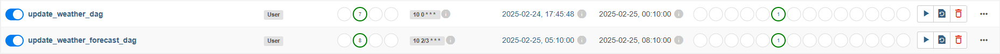
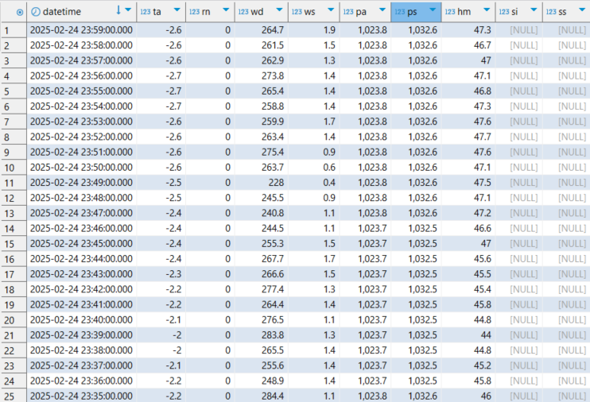
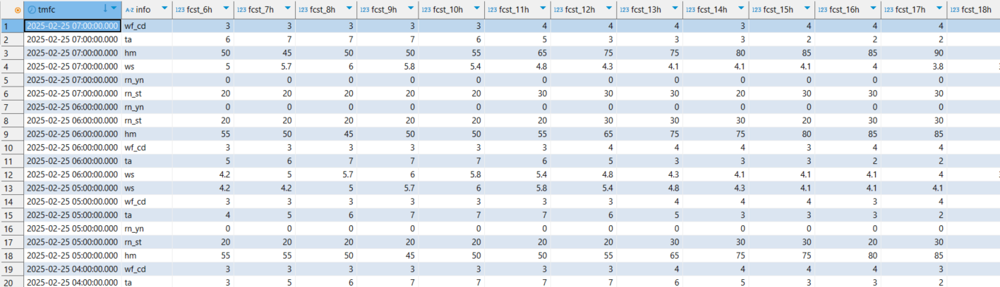

## Weather &amp; Weather Forecast Data Pipeline With Apache Airflow 🌤️

이 프로젝트는 Apache Airflow를 활용하여 기상청의 날씨, 날씨 예보 데이터를 일정 간격으로 자동 수집하고,
수집한 데이터를 PostgreSQL DB에 저장·관리하는 파이프라인을 구현한 예시입니다.

### 프로젝트 개요
- 목표
    - 기상청 및 공공데이터포털에서 제공하는 날씨·날씨 예보 데이터를 주기적으로 자동 수집
    - PostgreSQL DB에 적재하여, 추후 시계열 분석·모델링 등에 활용할 수 있는 기반 마련
- 기능
    - 특정 시간마다 날씨(AWS 매분자료) 데이터 조회 및 누락분 자동 채우기
    - 매일 3시간 간격으로 날씨 예보(단기예보) 데이터를 수집
    - 수집 후 전처리 및 DB 저장 (Airflow 작업 흐름으로 관리)

### 데이터 구조
#### 날씨 테이블
- datetime (timestamp) : 관측시각
- ta (float8) : 기온
- rn (float8) : 누적강수량
- wd (float8) : 풍향
- ws (float8) : 풍속
- pa (float8) : 현지기압
- ps (float8) : 해면기압
- hm (float8) : 습도
- si (float8) : 일사량
- ss (float8) : 일조량

#### 날씨 예보 테이블
- tmfc (timestamp) : 예보 발표시각
- info (varchar) : 예보 정보 구분
    - ta : 기온
    - rn_st : 강수확률
    - rn_yn : 강수형태
    - wf_cd : 하늘상태
    - hm : 습도
    - ws : 풍속
    - wd : 풍향
- fcst_{n}h (float8) : 발표 시각으로부터 n시간 뒤 예보값

### API 정보
- 날씨 데이터 API
    - [기상청 API HUB](https://apihub.kma.go.kr/)
    - 지상관측 > 방재기상관측(AWS) > AWS 매분자료
- 날씨 예보 데이터 API
    - [공공데이터포털](https://www.data.go.kr/)
    - 기상청_단기예보 ((구)_동네예보) 조회서비스

### Airflow 스케줄링
- 날씨 데이터 수집 주기
    - 매일 00:10에 실행
    - 이전 날짜 00:00 ~ 23:59까지의 매분 자료(AWS)를 한 번에 조회 후 DB 적재
- 날씨 예보 데이터 수집 주기
    - 매일 02:00부터 23:00까지 3시간 간격 (02, 05, 08, 11, 14, 17, 20, 23시) 실행

위 스케줄은 Airflow의 DAG 혹은 Cron 스케줄 설정에서 조정할 수 있습니다.

### 주요 파일 설명
#### update_weather.py
1. 주요 기능
    - [기상청 API HUB]에서 제공하는 AWS 매분자료를 특정 기간동안 조회
    - 결측(누락) 날짜 조회 → 해당 날짜별 AM(00시00분~ 11시59분) / PM(12시00분~ 23시59분) 데이터를를 합쳐서 DataFrame 생성
        - [기상청 API HUB]에서 1회 요청시 얻을 수 있는 데이터는 720개로 제한되어 있음
2. 주요 함수
    - `get_no_dates(db_config, cursor, start_date, end_date)`:
        - DB에 기록되지 않은 날짜 목록을 구함
    - `get_data(url, params)`:
        - 실제 API 응답을 텍스트 단위로 받아 DataFrame으로 변환
    - `fetch_weather_data(url, params, date)`:
        - 한 날짜(YYYYMMDD)에 대한 오전·오후 데이터를 합쳐서 최종 DataFrame으로 반환
    - `insert_data(db_config, connect, cursor, df)`:
        - 날씨 테이블에 Batch Insert
    - `main()`:
        - DB 연결, 누락 날짜 조회, 데이터 수집 및 DB 저장

#### update_weather_forecast.py
1. 주요 기능
    - [공공데이터포털]에서 제공하는 기상청 단기예보((구) 동네예보) API를 일정 간격(3시간)으로 호출
    - 발표시각과 예보시각(forecast_hour) 정보를 가공해, 예보 테이블에 저장
2. 주요 함수
    - `get_no_dates(db_config, cursor, start_date, end_date)`:
        - DB 테이블에 없는 발표시각을 찾아 반환
    - `process_1(df, tag_dict)`:
        - 수집된 JSON(단기예보)에서 필요한 항목(category)만 선별 & 날짜·시간 정보 가공
    - `process_2(df, start_date)`:
        - 3시간 간격 예보를 1시간 단위로 보정정
    - `process_3(df, connect, cursor, db_config)`:
        - 날씨 예보보 테이블에 Insert
    - `main()`:
        - DB 연결, 누락 날짜 조회, 데이터 수집 및 DB 저장

### 결과

#### DAGs

### 참고
- [Airflow 설치](https://geunuk.tistory.com/666)
- [PostgreSQL 설치](https://geunuk.tistory.com/669)